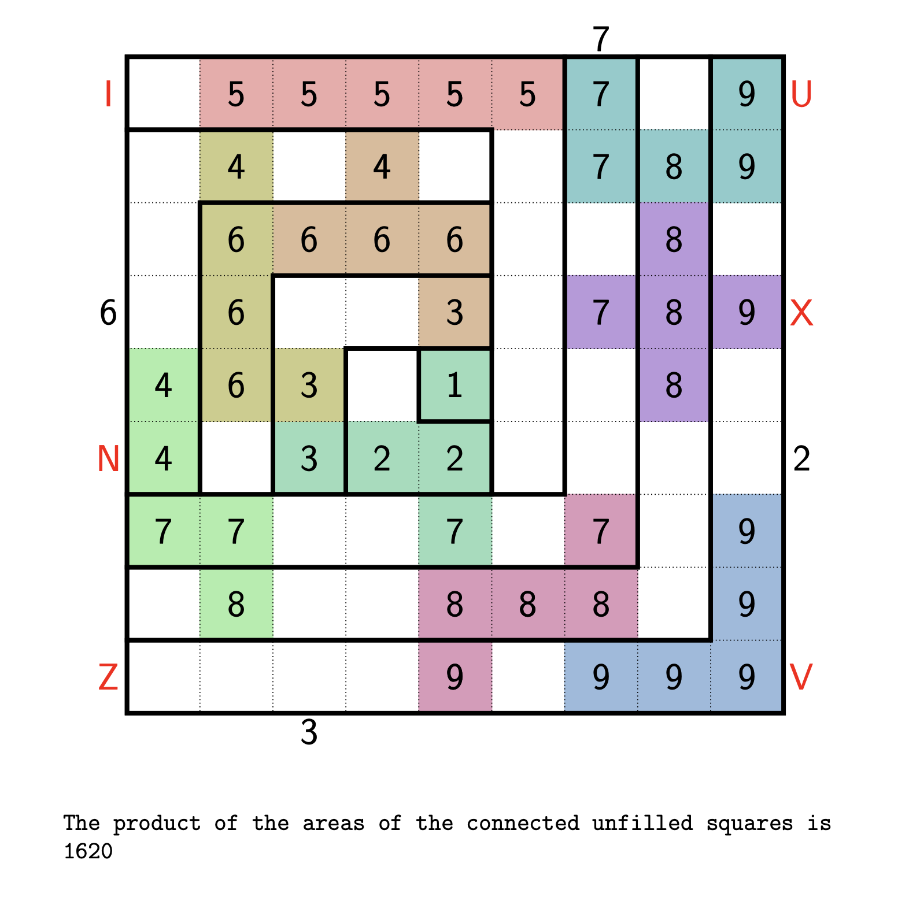

# [Hooks 11](https://www.janestreet.com/puzzles/hooks-11-index/) (September 2025)
This puzzle can be divided into searching for the hook partitions and pentomino decompositions. Each is done indpenendently, then one of the members of the product of feasible hook partitions and pentomino decompositions gives a solution.

## Hook partitions
There are $4^8=65536$ possible hook partitions (the hook or "corner" can go in one of four places $9-1$ times), but they can be filtered to just 259.

The filtering is done in two steps, where the first is simply to keep only the hook partitions whose width-1 hook match the provided grid,[^1] and the second (more involded) is to rule out partitions which lead to invalid digit--hook assignments.

An assignment is invalid when

- a digit must belong to a hook that's too small for it (i.e., a digit $d$ is in a hook with width $h$ and $d > 2h-1$) 
- more than one digit must belong to the same hook
- a digit cannot be assigned to any hook
- there are more digits left to assign than unoccupied hooks.
  
   

It turns out that for all 259 valid hook partitions each hook can only have one digit assigned to it, which is convenient.

## Pentomino decompositions
Pentomino decompositions are found by solving a [generalized exact cover](https://en.wikipedia.org/wiki/Exact_cover#Generalized_exact_cover) problem where the primary columns are (1) nine (out of the possible twelve) pentominoes and (2) the squares which were already filled with a digit (e.g. (4,4) with 1), and the secondary columns are the remaining $9\times9-5$ squares. 

[Algorithm X](https://en.wikipedia.org/wiki/Knuth%27s_Algorithm_X)[^2] is used to find the covers, and partial solutions which violate pentomino clues or fill a 2x2 region are pruned. The generated exact covers which aren't one connected component are also removed.

## Answer
Each hook partition--cover pair creates a potential completed grid.[^3] A completed grid is valid if digits only belong to their assigned hook and the digit sum for each pentomino is a multiple of 5. The final answer is the product of the areas of the connected groups of unfilled squares.

[^1]: This step alone cuts the number of hook partitions from 65536 to 4900.
[^2]: It isn't implemented it with dancing links because ... I didn't want to translate between python and c, but also because the pruning of partial solutions is enough that the extra efficiency isn't really needed.
[^3]: It is easy to fill the grid with digits when you have their placements from the pentomino decomposition and their values from the hook--digit assignments (which comes from the hook partition).
