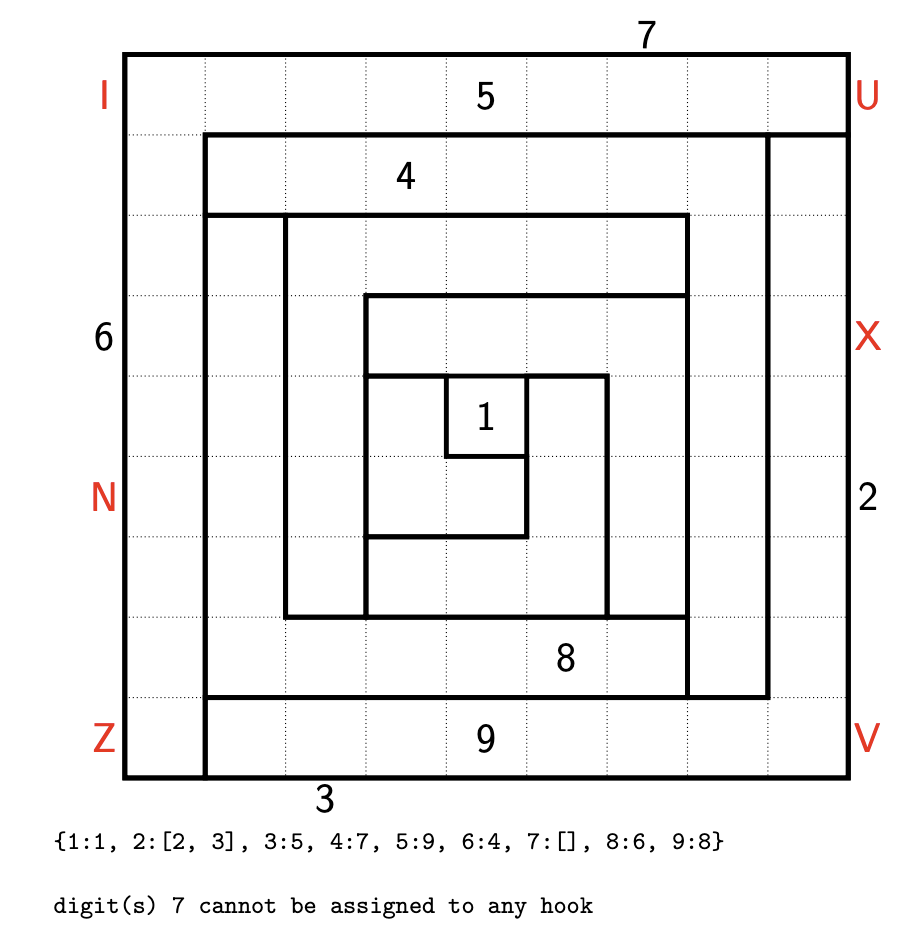
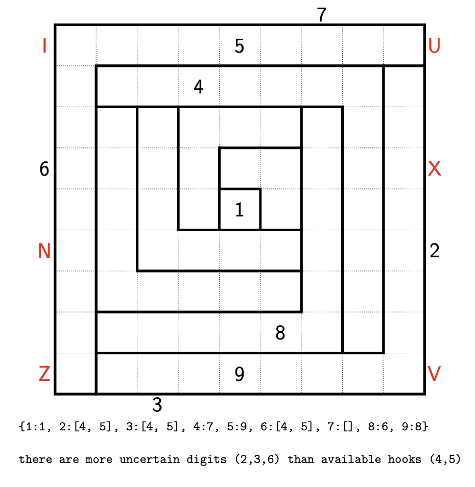

# Hooks 11 (September 2025)
This puzzle can be divided into two problems:
1. Find valid hook partitions
2. Find valid pentomino decompositions

The first problem can be handled by filtering all $4^8$ possible hook partitions using the clues, which ends up only leaving 259.[^1]

To filter the hook partitions, you can use (a) simply the position of the width 1 hook coordinate and (b) (somewhat more involved) find which hooks can be assigned to each digit, and rule out assignments where
    - a digit must belong to a hook that's too small for it (i.e., digit $d$ in hook with width $h$ and $d > 2h-1$)
    
    
    - more than one digit must belong to the same hook
    
    
    - a digit cannot be assigned to any hook
    

    - there are more digits left to assign than unoccupied hooks
    

It turns out that all remaining hook partitions after this filtering step have only one possible digit assignment per hook, when it could have been possible for at least two hooks to have at least two digit assignments.

[^1]: Filtering out the hook parititions which don't match the width 1 hook already cuts down the number from 65536 to 4900.