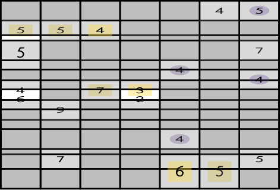

# [Shut the Box](https://www.janestreet.com/puzzles/current-puzzle/) (November 2025)

## Description
Remove one or more orthogonally connected groups of cells from the grid. Each of these groups must have at least one cell which is part of the grid boundary, and the remaining cells in the grid must form an orthogonally connected component without any holes which can be folded to form a rectangular prism (the "box").

Cells marked with arrow(s) are *not* part of the box. They indicate the direction of the nearest cell which is.

Cells marked with a number *are* part of the box, and the number indicates how many cells also belong to the box which are within one king's move of the cell (including the numbered cell).

Cells marked with a gray circle must be opposite another cell marked with a gray circle once the box is assembled.

Cells marked with a gray square must be adjacent to (and on the same face as) another cell marked with a gray square once the box is assembled.

The answer to the puzzle is the product of the six sums of numbers on each face of the box.

## Approach
Fill in the grid by hand and assembled the cut out the printed grid.

## Answer
Here's an animation of the box assembling!

Just the shut box.

